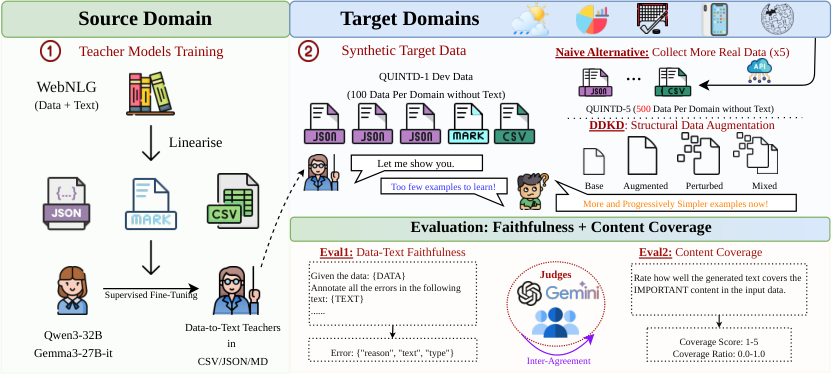
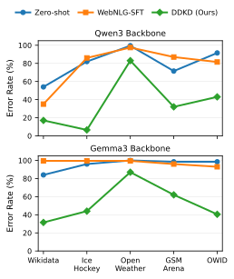

# 📊 Cross-Domain, Multi-Task Data-to-Text Generation without In-Domain Training Data

**Yifei Song · Kun Efimov-Zhang · Claire Gardent**

**Findings of EMNLP 2026**

[Paper](https://arxiv.org/abs/2608.23391) · [PDF](https://arxiv.org/pdf/2608.23391) · [Code guide](Cross-Domain-D2T-DDKD/README.md) · [Data guide](docs/DATA.md)

Official repository for our study of **data-driven knowledge distillation
(DDKD)** for data-to-text generation across five domains, without human-written
target-domain reference texts.

## Framework



1. **Initialize the teacher** with source-domain WebNLG supervision.
2. **Create synthetic target-domain examples** from structured inputs, using
   structural subsampling, perturbation, or both. QUINTD-5 provides a comparison
   using more real inputs.
3. **Distill a small student** and evaluate faithfulness and content coverage
   with two LLM judges and human annotations.

Pipeline from [Figure 2 of the paper](https://arxiv.org/html/2608.23391v2#S1.F2).

## Key Results

<p align="center">
  
</p>

Error rates averaged over two LLM judges; lower is better.
[Figure 1 of the paper](https://arxiv.org/html/2608.23391v2#S1.F1).

| Finding | Result |
| --- | --- |
| **Faithfulness** | DDKD improves both small model families across all five domains. |
| **Structural augmentation** | With a WebNLG-SFT teacher, DDKD-Mixed achieves **0.10** NormAvg, compared with **0.20** when scaling to 500 real inputs. Lower is better. |
| **Human validation** | DDKD ranks first overall: **0.09** NormAvg, ahead of zero-shot (**0.77**) and WebNLG-SFT (**0.91**). |
| **Content coverage** | Faithfulness gains do not depend on omitting task-relevant content. |

See [Table 4, Appendix I, and Appendix K](https://arxiv.org/html/2608.23391v2)
for the full results.

## Data and Outputs

The release includes **QUINTD-5 inputs**, benchmark test inputs, saved model
outputs, LLM evaluations, and anonymized human annotations. Saved results can
be analyzed without new model runs or API requests.

Download [data.zip](Cross-Domain-D2T-DDKD/data.zip) and extract it inside
`Cross-Domain-D2T-DDKD/`. The [data guide](docs/DATA.md) describes the contents,
formats, and release scope; [data sources](docs/DATA_SOURCES.md) lists attribution
and terms.

## Repo Layout

```text
.
├── images/                         # Pipeline and result figures from the paper
├── docs/
│   ├── DATA.md                     # Data contents and formats
│   ├── DATA_SOURCES.md             # Sources and attribution
│   └── EXPERIMENTS.md              # Analysis commands and experiment settings
├── Cross-Domain-D2T-DDKD/
│   ├── README.md                   # Installation and usage
│   ├── data.zip                    # QUINTD-5 inputs and evaluation artifacts
│   ├── data_manifest.json          # File inventory and checksums
│   ├── src/eval/                   # Faithfulness, coverage, and human evaluation
│   ├── src/inference/              # API generation
│   ├── script/                     # Evaluation and local model examples
│   └── tests/                      # Offline regression tests
├── CITATION.cff
└── LICENSE
```

Run scripts from `Cross-Domain-D2T-DDKD/`. Start with the
[code guide](Cross-Domain-D2T-DDKD/README.md); use the
[experiment guide](docs/EXPERIMENTS.md) for analyses of individual paper results.

## Citation

```bibtex
@misc{song2026crossdomain,
  title         = {Cross-Domain, Multi-Task Data-to-Text Generation without In-Domain Training Data},
  author        = {Yifei Song and Kun Efimov-Zhang and Claire Gardent},
  year          = {2026},
  eprint        = {2608.23391},
  archivePrefix = {arXiv},
  primaryClass  = {cs.CL},
  url           = {https://arxiv.org/abs/2608.23391}
}
```

## License

Code and project documentation use the [MIT License](LICENSE). Data retains
its [source terms](docs/DATA_SOURCES.md). The two paper figures are reproduced
from the [arXiv version](https://arxiv.org/html/2608.23391v2), under
[CC BY 4.0](https://creativecommons.org/licenses/by/4.0/).
